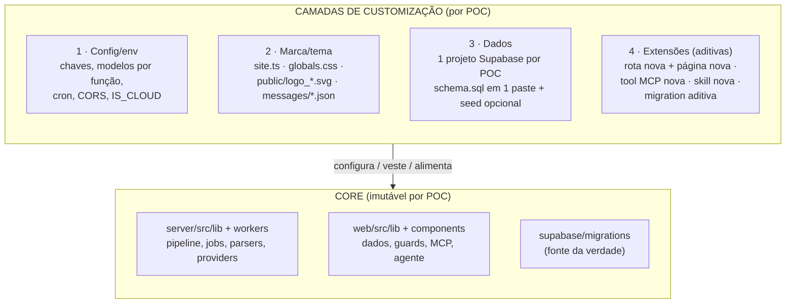
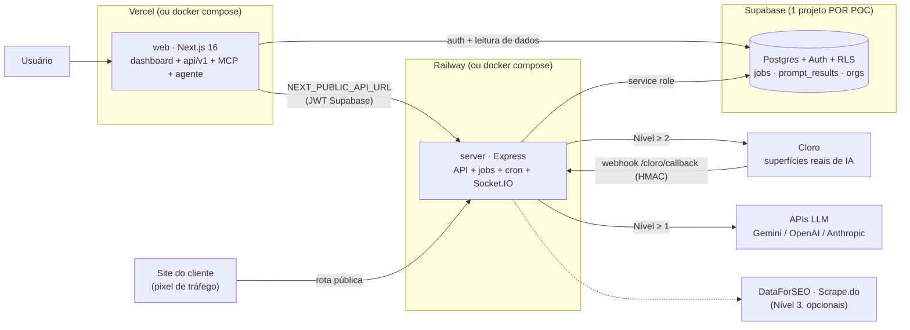

# Arquitetura para POCs — Ansvisor / Ultravis

> **Objetivo:** estudo das aplicações do [ansvisor/ansvisor](https://github.com/ansvisor/ansvisor) e proposta de uma arquitetura **simples**, que permita **customização rápida para POCs** (provas de conceito) sem perder a capacidade de acompanhar o upstream.
>
> **Data:** 07/ago/2026 · **Complementa:** [`ULTRAVIS-SETUP-BR.md`](./ULTRAVIS-SETUP-BR.md) (setup de infra do fork BR)

---

## 1. TL;DR

O Ansvisor já nasce bem fatorado para POCs: **3 peças** (web Next.js, server Express, Supabase) + **modo self-hosted que desliga todo o billing** (`IS_CLOUD=false` → tudo liberado). A proposta é **não inventar arquitetura nova** — e sim formalizar:

1. **Core imutável** — nunca editar `server/src/lib`, `server/src/workers` e `web/src/lib` por causa de uma POC.
2. **4 camadas finas de customização** — env/config, marca/tema, dados (1 projeto Supabase por POC) e extensões aditivas.
3. **4 níveis de POC** (0 a 3) que escalam custo e nº de chaves de API conforme a necessidade — do demo sem nenhuma chave até a plataforma completa.
4. **Convenção `pocs/`** — cada POC é uma pasta com envs de exemplo + checklist de rebrand, e um branch `poc/<nome>`.

Com isso, uma POC nova sobe em **~1 hora** (Seção 8) e morre sem deixar rastro (apagar 3 recursos de infra + 1 branch).

---

## 2. Estudo — o que o Ansvisor é hoje

Plataforma open-source (MIT) de **AI Visibility / AEO**: mede com que frequência engines de IA (ChatGPT, Gemini, Perplexity, Copilot, Grok, Claude, Google AI Overview/AI Mode) citam uma marca, quais concorrentes aparecem no lugar, quais URLs são citadas, e gera briefs de conteúdo para melhorar essa presença.

### 2.1 Componentes

| Componente | Stack | Papel |
|---|---|---|
| **`web/`** | Next.js 16, React 19, TS, Tailwind 4, next-intl, Zustand, Recharts | Dashboard, marketing, onboarding. Hospeda também 4 superfícies de API próprias: `/api/v1` (REST pública com chaves `ans_`), `/api/mcp` (servidor MCP), `/api/agent` (assistente conversacional), `/api/stripe` (billing, só cloud) |
| **`server/`** | Express (Node ESM), Vercel AI SDK, Socket.IO, node-cron, Zod, Pino | API do dashboard (JWT Supabase), pipeline de tracking, fila de jobs, webhook do Cloro, pixel de tráfego público, endpoints internos (`CRON_SECRET`) |
| **`supabase/`** | Postgres + Auth + RLS | Migrations numeradas (fonte da verdade), `schema.sql` gerado para instalação fresh em 1 paste, `seed.sql` com demo local (`demo@ansvisor.local` / `demo123`) |
| **`skills/`**, **`integrations/`** | Claude Skills, Looker Studio | Superfícies de extensão já existentes (o MCP em `web/src/app/api/mcp` também é uma) |

### 2.2 O fluxo central (pipeline de tracking)

O coração do produto é `server/src/workers/tracking-worker.js`:

```
prompt × (modelos API + plataformas scrapadas) × regiões
   │
   ├── Plataformas reais ──► Cloro (chatgpt-web, chatgpt-shopping, google-aio,
   │                         google-aimode, copilot-web, grok-web,
   │                         perplexity-web, gemini-web)
   │                         · webhook (recomendado) ou polling inline
   │
   └── Modelos via API ────► Vercel AI SDK (OpenAI / Anthropic / Google)
                             · registry ativa só quem tem chave no .env
   │
   ▼
parse (menções, citações, sentimento via LLM, score, concorrentes)
   │
   ▼
prompt_results ──► dashboards, relatórios PDF, API v1, MCP, agente
```

Pontos que importam para POC:

- **Fila de jobs sem Redis** — tabela `jobs` no Postgres + runner em processo (concorrência 2, retry com backoff). Zero infra extra.
- **Cron embutido** — self-hosted usa `node-cron` (`DAILY_CRON_SCHEDULE`); cloud usa Vercel Cron → endpoint interno. Nada a configurar fora do processo.
- **Progresso em tempo real** — Socket.IO emite `tracking:complete` / progresso de job para o dashboard.
- **Cloro é opcional por prompt** — cada prompt tem arrays `models` (API) e `platforms` (scraper). Prompt só com `models` roda **sem Cloro** (base do Nível 1 abaixo).
- **Planos** — `IS_CLOUD=false` resolve tudo para o plano `self_hosted` (sem limites, todas as features, sem Stripe). O gating de billing simplesmente não existe em POC.

### 2.3 Serviços externos e quando são necessários

| Serviço | Para quê | Obrigatório? |
|---|---|---|
| Supabase | Banco, Auth, RLS | **Sim** (free tier serve) |
| 1 provider LLM (Google/OpenAI/Anthropic) | Tracking via API, sugestões, sentimento, briefs | **Sim, pelo menos um** (Gemini Flash é o default de sugestões) |
| Cloro | Scraping das superfícies reais de IA | Não — só p/ Nível ≥ 2 |
| DataForSEO | Volume de busca por prompt | Não |
| Scrape.do | Site Audit (fetch + JS render) | Não |
| Stripe | Billing | **Nunca em POC** (só cloud) |
| PostHog | Product analytics | Não (off por default) |

---

## 3. Princípio: core imutável + camadas finas

O risco nº 1 de usar um fork para POCs é o **drift**: cada POC mexe num arquivo de domínio, o fork diverge do upstream (que evolui rápido — ver `CHANGELOG.md`) e em 3 meses ninguém consegue mais fazer merge. A arquitetura proposta ataca exatamente isso:



**Regras anti-drift** (as 5 que valem a pena):

1. Necessidade de uma POC **nunca** justifica editar o core. Se a POC "precisa" mudar o core, ou vira contribuição para o upstream, ou a POC está mal escopada.
2. Customização vive apenas nos arquivos de borda: `*.env*`, `web/src/config/site.ts`, `web/src/app/globals.css`, `web/public/`, `web/messages/*.json`, `web/src/i18n/routing.ts`. Merge com upstream nesses arquivos é trivial.
3. Feature nova = **arquivo novo** (rota nova em `server/src/routes/` + página nova no dashboard), nunca reescrita de arquivo existente.
4. Migration só **aditiva** (tabela/coluna nova com prefixo próprio, ex. `poc_`), nunca alterando tabela do core.
5. Manter `upstream` remoto (`ansvisor/ansvisor`) e rebasear `main` do fork periodicamente. O branding permanente do fork (Ultravis) mora em `main`; POCs saem de `main`.

---

## 4. Arquitetura de runtime proposta (por POC)



Decisões e porquês:

- **1 projeto Supabase por POC** (não 1 org por POC na mesma instância): isolamento total de dados do cliente, RLS sem risco cruzado, e a POC morre apagando o projeto. A alternativa multi-tenant (1 instância, 1 `organization` por POC — o modelo de dados já suporta) só vale para **demos internas** onde marca/tema global não incomodam, já que tema e marca são por instância, não por org.
- **Sem serviço novo de infra**: nada de Redis, filas gerenciadas ou k8s. A fila em Postgres e o cron em processo já cobrem a escala de POC (e da própria cloud deles).
- **Duas topologias suportadas**, escolhidas por contexto:

| Topologia | Quando usar | Custo |
|---|---|---|
| **A — `docker compose up`** (1 VM ou local) | Demo interna, teste de viabilidade, hackday | ~R$ 0 (local) |
| **B — Vercel (web) + Railway (server) + Supabase** | POC exposta ao cliente, com domínio próprio (`poc-acme.ultravis.ai`) | free tiers + Railway (~US$ 5/mês) |

A topologia B é exatamente a documentada em `ULTRAVIS-SETUP-BR.md` — o fork Ultravis é, na prática, a primeira "POC" permanente dessa arquitetura.

---

## 5. Níveis de POC (escada de custo e esforço)

A maior alavanca de simplicidade: **quase tudo é opcional**. Escolha o nível pelo que a POC precisa provar.

| Nível | Prova o quê | Chaves necessárias | Cloro? | Custo típico |
|---|---|---|---|---|
| **0 — Demo com seed** | UX, telas, pitch | **Nenhuma** — `npx supabase db reset` popula com `seed.sql` (org demo, ~120 resultados em todas as engines) | Não | R$ 0 |
| **1 — Tracking via API** | Métrica real de visibilidade nos modelos (ChatGPT/Gemini/Claude via API) | 1 chave LLM (recomendado: `GOOGLE_GENERATIVE_AI_API_KEY`, Gemini Flash é o default) | Não — prompts configurados só com `models` | centavos/dia |
| **2 — Superfícies reais** | Visibilidade nas interfaces reais (ChatGPT web, AI Overview, Perplexity…) | Nível 1 + `CLORO_API_KEY` (+ `CLORO_WEBHOOK_URL` recomendado) | Sim | por scrape (Cloro) |
| **3 — Plataforma completa** | Volumes de busca + Site Audit + briefs no fluxo do cliente | Nível 2 + `DATAFORSEO_*` + `SCRAPEDO_API_KEY` | Sim | assinaturas dos serviços |

Regra de bolso: **comece toda POC no Nível 1** e suba de nível apenas quando o cliente pedir o dado que falta. O Nível 0 existe para reunião de venda antes de existir POC.

---

## 6. Pontos de customização oficiais

Tudo abaixo já existe no código — customizar uma POC é tocar **somente** nestes pontos:

| O que customizar | Onde | Como |
|---|---|---|
| Nome, descrição, URLs, links legais | `web/src/config/site.ts` | Editar a constante `siteConfig` |
| Cores/tema | `web/src/app/globals.css` | Tokens CSS (`--background`, `--primary`, …) |
| Logos e ícones de engines | `web/public/logo_light.svg`, `logo_dark.svg` | Substituir arquivos |
| Idioma e textos | `web/messages/pt-BR.json`, `en.json` + `web/src/i18n/routing.ts` | Editar mensagens; `defaultLocale` (o fork já é `pt-BR`) |
| Providers de IA ativos | `server/.env` (chaves) | O registry (`server/src/lib/ai-provider.js`) ativa só quem tem chave |
| Modelo por função | `server/.env`: `DEFAULT_SUGGESTION_MODEL`, `TOPIC_SUGGESTION_MODEL`, `PROMPT_SUGGESTION_MODEL`, `COMPETITOR_SUGGESTION_MODEL`, `AUDIT_LLM_MODEL` | Formato `provider/modelo` (ex. `google/gemini-3-flash-preview`) |
| Frequência do tracking | `server/.env`: `DAILY_CRON_SCHEDULE` | Cron padrão (`0 6 * * 1` semanal → `0 6 * * *` diário) |
| Superfícies rastreadas | Por prompt, no dashboard (arrays `models`/`platforms`) | Dado, não código |
| Multiplicador de volume IA | `server/.env`: `AI_VOLUME_MULTIPLIER` | Ex. `0.15` |
| Modo POC (sem billing/limites) | `IS_CLOUD=false` + `NEXT_PUBLIC_IS_CLOUD=false` | Já é o default |
| Extensão de análise p/ o cliente | `web/src/app/api/mcp/` (tool nova), `skills/` (skill nova), `integrations/` | Arquivos novos, aditivos |

O que **não** customizar em POC: `server/src/config/plans.js` (o plano `self_hosted` já é ilimitado), qualquer coisa em `lib/`/`workers/`, e o schema core.

---

## 7. Convenção `pocs/`

Cada POC ganha um branch e uma pasta versionada com sua configuração **sem segredos**:

```
pocs/
├── README.md            # este fluxo, resumido
├── _template/           # copiar para iniciar uma POC
│   ├── README.md        # identidade, nível, escopo, critério de sucesso
│   ├── server.env.example
│   ├── web.env.example
│   └── branding.md      # checklist de rebrand (site.ts, css, logos, messages)
└── acme/                # exemplo: POC do cliente Acme (branch poc/acme)
```

Fluxo: `git checkout -b poc/acme main` → `cp -r pocs/_template pocs/acme` → preencher envs e checklist → aplicar rebrand (camada 2) → deploy (topologia A ou B). Segredos ficam só no Railway/Vercel/`.env` local — a pasta versiona a **estrutura** da configuração, nunca os valores.

Quando a POC vira produto: o que for genérico sobe para `main` (ou PR no upstream); o resto morre com o branch.

---

## 8. Playbook — POC nova em ~1 hora

Pré-requisitos: contas Supabase/Vercel/Railway (já existem, ver `ULTRAVIS-SETUP-BR.md`), 1 chave Gemini.

1. **Branch + pasta** (5 min) — `git checkout -b poc/<nome> main`; copiar `pocs/_template` → `pocs/<nome>`.
2. **Supabase** (10 min) — criar projeto `poc-<nome>`; colar `supabase/schema.sql` no SQL Editor → Run; copiar URL + anon + service_role.
3. **Envs** (10 min) — preencher a partir dos exemplos da pasta da POC (`IS_CLOUD=false`; Nível 1: só a chave Gemini).
4. **Rebrand mínimo** (15 min) — `site.ts` (nome/URLs), `globals.css` (2–4 tokens de cor), logos. Textos `messages/` só se o padrão Ultravis não servir.
5. **Deploy** (15 min) — Topologia A: `docker compose up --build`. Topologia B: Railway (root `server/`) + Vercel (root `web/`) + domínio `poc-<nome>.ultravis.ai`.
6. **Smoke test** (5 min) — criar conta → criar marca + 3 prompts (só `models`) → "Rodar agora" → score aparece em ~1 min; logs do server mostram `tracking results stored`.

Encerramento da POC: apagar projeto Supabase + serviço Railway + projeto Vercel; arquivar branch. Nada compartilhado sobra.

---

## 9. Evoluções propostas (backlog, não bloqueiam POC)

Em ordem de valor, quando alguma POC pedir:

1. **Seed parametrizável por marca** — hoje `seed.sql` é fixo (marca demo). Um script que gere seed com a marca/concorrentes do cliente tornaria o Nível 0 apresentável com a cara do cliente, ainda sem nenhuma chave.
2. **Adapter de scraper plugável** — `PLATFORM_PROVIDER` já existe no env, mas só `cloro` é implementado. Formalizar a interface (submit/poll/parse) destravaria ScrapeLLM (item do roadmap upstream) e um **provider mock** para demo do fluxo completo offline.
3. **Tema por env** — mover os ~6 tokens principais de `globals.css` para `NEXT_PUBLIC_THEME_*`, zerando o diff de CSS por POC.
4. **BYO keys por organização** — item do roadmap upstream; permitiria multi-POC numa instância só com custo por cliente. Só vale se o volume de POCs simultâneas crescer.

Anti-objetivos (overengineering para o estágio atual): sistema de plugins, k8s/filas gerenciadas, multi-tenancy white-label por org, painel de administração de POCs.

---

## 10. Riscos

| Risco | Mitigação |
|---|---|
| Drift do fork vs. upstream (CHANGELOG grande, ritmo alto) | Regras da Seção 3; rebase mensal de `main`; POCs sempre a partir de `main` |
| Dependência do Cloro (serviço pago, terceiro) | Nível 1 não usa; adapter plugável (Seção 9.2) como plano B |
| Segredo vazado em pasta de POC | `pocs/` versiona apenas `*.example`; segredos só em Railway/Vercel/local |
| POC "esquecida" gastando crédito (cron diário chamando LLM/Cloro) | `DAILY_CRON_SCHEDULE` semanal por default nas POCs; desativar marca (`is_active=false`) ou apagar infra no encerramento |
| Supabase free tier pausa projeto inativo após ~1 semana | Aceitável para POC; reativar no dashboard antes da demo |
