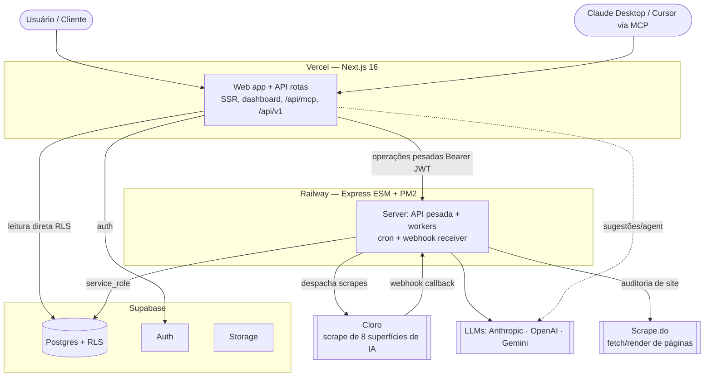
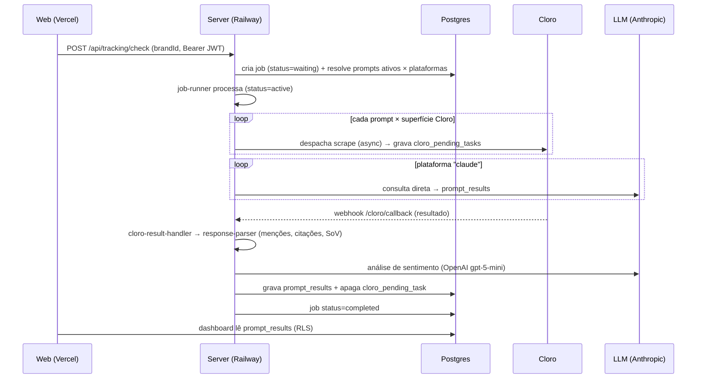
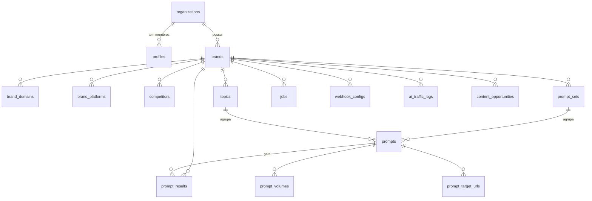

# Arquitetura técnica — Ultravis

> Documentação técnica de referência: stack, topologia, fluxos, modelo de
> dados (nível banco), segurança e decisões de arquitetura. Para o estado
> operacional do projeto ver `../CONTEXTO.md`; para as regras do fork ver
> `../ARQUITETURA-POCS.md`; para ambientes/deploy ver `AMBIENTES.md`.
>
> **Última atualização:** 09/ago/2026

---

## 1. Visão geral

Ultravis mede a visibilidade de marcas nas **respostas de assistentes de IA**
(AEO/GEO). O sistema tem três peças com responsabilidades distintas: um
**frontend serverless** (leitura, UI), um **worker persistente** (trabalho
pesado e assíncrono) e um **banco Postgres gerenciado** (dados + auth). A
medição em si é terceirizada para o **Cloro** (scraping das superfícies de IA)
e provedores de LLM.

**Princípio central:** o Vercel é *"responda rápido e morra"* (stateless); o
Railway é *"fique ligado e faça o trabalho pesado"* (stateful/assíncrono). Ver
ADR‑1 (§8).

## 2. Stack por camada

| Camada | Tecnologia | Versão | Papel |
|---|---|---|---|
| **Web** | Next.js (App Router) | 16.1 | UI, SSR, rotas de API (MCP, v1) |
| | React | 19.2 | |
| | next-intl | 4.8 | i18n pt-BR (default) / en |
| | Tailwind CSS | 4 | estilo |
| | Zustand | 5 | estado client (marca ativa etc.) |
| | Vercel AI SDK (`ai`, `@ai-sdk/anthropic`) | 6 / 3 | AI Agent + sugestões (BYOK) |
| | `@modelcontextprotocol/sdk` | 1.29 | servidor MCP |
| | `@react-pdf/renderer` | 4.5 | geração de relatórios PDF |
| | `@supabase/supabase-js` + `ssr` | 2 / 0.9 | acesso ao banco/auth (RLS) |
| | Zod | 4 | validação |
| | Recharts, Sonner, PostHog | — | gráficos, toasts, analytics |
| **Server** | Express (ESM) | 4.18 | API pesada + workers |
| | PM2 | 5 | supervisor de processo |
| | node-cron | 4 | censo semanal |
| | Vercel AI SDK + `openai` + `@anthropic-ai/sdk` | — | trackers de LLM |
| | cheerio | 1 | parse de HTML (auditoria) |
| | helmet, cors, express-rate-limit | — | segurança HTTP |
| | pino | 10 | logs estruturados |
| | socket.io | 4 | progresso de job em tempo real |
| **Banco/Auth** | Supabase (Postgres 15+) | — | dados, RLS, auth, storage |
| **Medição** | Cloro | — | scrape das 8 superfícies de IA |
| | Scrape.do | — | fetch/render de páginas (auditoria) |
| | DataForSEO | — | dados auxiliares (opcional) |

## 3. Topologia de deploy

| Componente | Host | Endereço | Deploy |
|---|---|---|---|
| Web | Vercel (`utravisaiclaude`) | `ultravis.ai` | push na `main` → automático |
| Server | Railway (`ultravis-server`) | `api.ultravis.ai` (root `/server`) | push na `main` → automático |
| Banco/Auth | Supabase (`twhqjfbealruvcbvkegc`) | — | migrations versionadas |
| DNS | Cloudflare | nuvem cinza (DNS-only) | — |

- **CORS** no server libera `ultravis.ai`, `app.ultravis.ai`, previews Vercel.
- **Cron** self-hosted no server: `0 6 * * 1` (segunda 06:00 UTC).
- Detalhes de ambientes/preview/staging: `AMBIENTES.md`.

## 4. Fluxos principais

### 4.1 Rastreamento (o coração do produto)

- **Modo webhook** (não polling): os resultados do Cloro chegam de forma
  assíncrona no `/cloro/callback`, então **sobrevivem a restart/deploy** do
  server. `cloro_pending_tasks` é o livro-caixa das tarefas em voo (ADR‑2).
- **Superfícies (8):** ChatGPT, Google AI Overviews (AIO), Google AI Mode,
  Gemini, Perplexity, Copilot, Grok, Shopping.
- **Custo:** cada scrape = 1 crédito Cloro, **cobrado no despacho** e
  irreversível — daí a trava de confirmação antes do "Rodar Tudo".

### 4.2 Censo semanal (cron)
`node-cron` no server dispara `0 6 * * 1` um rastreamento de **todas as marcas
ativas**. Mesmo pipeline do 4.1. Em nuvem (`IS_CLOUD=true`) o cron externo usa
`CRON_SECRET`; self-hosted usa o cron interno.

### 4.3 Auditoria de site (dimensão D1 do Índice de Citabilidade)
Web/onboarding → `POST /api/audits` → o server busca o HTML da página via
**Scrape.do** (`SCRAPEDO_API_KEY`), o `cheerio` parseia, gera score 0–100 e
recomendações → `site_audits`. Alimenta a Legibilidade (D1) na página de
Citabilidade.

### 4.4 MCP & API v1 (superfície programática)
No **Next.js** (não no Express): `POST /api/mcp` (Streamable HTTP, ~23 tools) e
`/api/v1/*` (REST paralela). Auth por **API key** (`ans_`). Detalhe: `MCP.md`.

## 5. Modelo de dados (nível banco)

**24 tabelas** em `public`, tudo com **RLS**. A hierarquia de posse é
`organization → brand → (topics, prompts, results…)`. Migrations versionadas em
`supabase/migrations/` (00001–00035); `schema.sql` é o consolidado (CI cobra).

### Tabelas por domínio

| Domínio | Tabelas |
|---|---|
| **Conta/acesso** | `organizations`, `profiles`, `invitations`, `api_keys` |
| **Marca** | `brands`, `brand_domains`, `brand_platforms`, `competitors` |
| **Prompts** | `topics`, `prompt_sets`, `prompts`, `prompt_volumes`, `prompt_target_urls`, `topic_suggestions`, `prompt_notes` |
| **Medição (o dado)** | `prompt_results` (linha central: menções, citações, sentimento, visibility_score, competitor_mentions), `ai_traffic_logs` |
| **Execução (server-only)** | `jobs`, `cloro_pending_tasks` |
| **Conteúdo/auditoria** | `content_opportunities`, `site_audit_usage` |
| **Quotas/uso** | `brief_usage`, `volume_usage`, `site_audit_usage` |
| **Integrações** | `webhook_configs` |

> **Nota:** `site_audits` e `agent_*`/`prompt_suggestions` existem via migrations
> e tipos gerados; nem tudo aparece no `schema.sql` consolidado igual (ex.:
> `jobs` não está nos tipos do web — ver ADR‑6).

### Modelo de RLS (segurança no banco)

Dois padrões:

1. **Org-scoped (a maioria):** RLS com policy que amarra a linha ao usuário via
   `brand_id → brands → profiles(organization_id) = auth.uid()`. O cliente
   autenticado só enxerga dados da sua organização — sem filtro no código.
2. **Server-only (`jobs`, `prompt_volumes`):** RLS **habilitada sem policy** →
   **nenhum** usuário lê; só o `service_role` (o server) acessa. Por isso o
   monitoramento de jobs vive no `/ops`/server, não no app (ADR‑6).

## 6. Autenticação & segurança

| Superfície | Mecanismo |
|---|---|
| App (web) | Supabase Auth (e-mail/senha + Google OAuth); sessão via cookie SSR |
| Acesso a dados | **RLS** no Postgres (org-scoped) — defesa no banco, não no código |
| API pesada (web→server) | Bearer **JWT** do Supabase repassado ao Express |
| MCP / API v1 | **API key** `ans_` (tabela `api_keys`, hash) — clientes externos |
| Rotas internas do server | Bearer secret dedicado (`/api/internal/*`) |
| Páginas admin (Custos) | gate por **e-mail de operador** (`NEXT_PUBLIC_ADMIN_EMAILS`) — 3 camadas: nav oculto, redirect no layout, throw na action |
| Painel `/ops` | **HTTP Basic Auth** próprio (`OPS_USER`/`OPS_PASS`), `timingSafeEqual`, fail-closed 503 |
| HTTP | helmet, CORS allowlist, rate-limit em `/api` |
| Segredos | só em painéis (Railway/Vercel/Supabase); **nunca** em código/commit |

## 7. Provedores de IA & configuração

| Provider | Papel | Config |
|---|---|---|
| **Cloro** | scrape das 8 superfícies | `CLORO_API_KEY`, `CLORO_WEBHOOK_URL`, `CLORO_WEBHOOK_SECRET` |
| **Anthropic** | rastreio via API (`claude-sonnet`) + AI Agent | `ANTHROPIC_API_KEY` |
| **OpenAI** | sugestões + sentimento (`gpt-5-mini`) | `OPENAI_API_KEY`, `*_SUGGESTION_MODEL`, `AUDIT_LLM_MODEL` |
| **Gemini** | reserva de sugestões (grounding) | `GOOGLE_GENERATIVE_AI_API_KEY` |
| **Scrape.do** | auditoria de site | `SCRAPEDO_API_KEY` |
| **DataForSEO** | dados auxiliares (opcional) | `DATAFORSEO_LOGIN/PASSWORD` |

Modelo por função é **configurável por env** (`DEFAULT/TOPIC/PROMPT/COMPETITOR_SUGGESTION_MODEL`,
`AUDIT_LLM_MODEL`, formato `provider/modelo`) — trocar de modelo não exige
deploy de código (ADR‑7).

## 8. Decisões de arquitetura (ADRs)

**ADR‑1 · Web serverless (Vercel) + worker persistente (Railway).** O
rastreamento leva minutos–horas, tem cron e recebe webhooks — trabalho que o
serverless (timeout, sem daemon) não suporta. Um processo sempre-ligado é
necessário; Railway é simples e barato (alternativas: Render/Fly/VPS). Herdado
do upstream, é o desenho padrão pro tipo de app.

**ADR‑2 · Cloro em modo webhook (não polling).** Deploy do server matava runs
em polling. Com callback assíncrono (`/cloro/callback` + `cloro_pending_tasks`),
os resultados sobrevivem a restart/deploy.

**ADR‑3 · Supabase (Postgres + Auth + RLS).** Um só serviço entrega banco
relacional, auth e segurança por linha (RLS) — a segurança mora no banco, não
espalhada no código.

**ADR‑4 · MCP + API v1 no Next.js.** A superfície programática (MCP + REST)
vive no app Vercel (edge/serverless, escala sozinho), separada do worker. Torna
a Ultravis plugável em qualquer IA (diferencial).

**ADR‑5 · Fork disciplinado (core imutável + camadas).** Não reescrever o core
do Ansvisor; features são aditivas (rota/componente/migration nova ≥00034) pra
manter o sync com o upstream viável. Ver `../ARQUITETURA-POCS.md`.

**ADR‑6 · Tabelas server-only via RLS sem policy.** `jobs`/`prompt_volumes` só
o `service_role` lê. Blinda dados operacionais do cliente; consequência: o log
de execução vive no `/ops` (service role), não no app.

**ADR‑7 · Modelo de IA por função via env.** Cada função (tópico, prompt,
concorrente, auditoria, sentimento) escolhe o modelo por variável — trocar de
provedor/modelo em runtime, sem deploy.

**ADR‑8 · Monitoramento de domínio em código próprio (watchdog).** O upstream
não tem alerting nenhum. Ferramentas genéricas (Uptime Kuma, Sentry) não
entendem degradação de domínio — ex.: "sentimento 100% neutro = provider
caindo em fallback" (incidente real do 401 da OpenAI em 10/ago, que rodou uma
madrugada sem ninguém saber). Solução: ~200 linhas testadas dentro do próprio
server (custo zero, deploy junto), com alerta push via `ALERT_WEBHOOK_URL`.
Complementos externos (uptime check, Gatus/Prometheus) entram quando escalar.

## 8.1 Observabilidade & operação

| Camada | O quê | Onde |
|---|---|---|
| **Watchdog** (ativo) | A cada 15 min checa: jobs falhos, fila Cloro presa >2h, sentimento 100% neutro (provider degradado), censo ausente >8 dias. Alerta deduplicado (re-alerta após 6h) → log + POST em `ALERT_WEBHOOK_URL` (payload Slack/n8n) | `server/src/lib/watchdog.js` |
| **Painel `/ops`** (passivo) | Máquina, consumo, execuções recentes com `failed_reason`, contas. Basic Auth própria | `server/src/routes/ops.js` |
| **Custos & Consumo** (app) | Estimativa de gasto por provider, operador-only | `dashboard/admin/costs` |
| **Auditoria diária de código** | Cron 09:00 UTC: Gitleaks + npm/yarn audit + Semgrep (issue `auditoria` se houver achado) + agente Claude auditando o diff de 24h (requer secret `ANTHROPIC_API_KEY`) | `.github/workflows/auditoria.yml` |
| **Dependabot** | PRs semanais de atualização de dependências (web, server, actions) | `.github/dependabot.yml` |
| **Logs** | pino estruturado → Railway; custo real de tokens nos consoles dos providers | — |

## 9. CI/CD & validação

- **CI** (GitHub Actions): `web` (prettier `format:check`, eslint, `tsc`,
  vitest) · `server` (eslint, `format:check`, vitest 124 testes) · `schema`
  (regenera `schema.sql` das migrations e falha se divergir).
- **Deploy:** merge na `main` → Vercel (web) + Railway (server) automáticos.
- **Validação local antes de commit:**
  `cd web && yarn typecheck && yarn lint && yarn format`;
  `cd server && npm run lint && npm test`. Após migration:
  `bash supabase/build-schema.sh`.

## 10. Camadas de customização do fork (onde mexer)

Env vars (modelos, cron) · marca (`web/src/config/site.ts`, `globals.css`,
logos) · dados (dashboard) · extensões aditivas (rotas/páginas/migrations
novas). O core (`server/src/lib`, `workers`, `web/src/lib`, `plans.*`) é
imutável. Detalhe e playbook: `../ARQUITETURA-POCS.md`.
